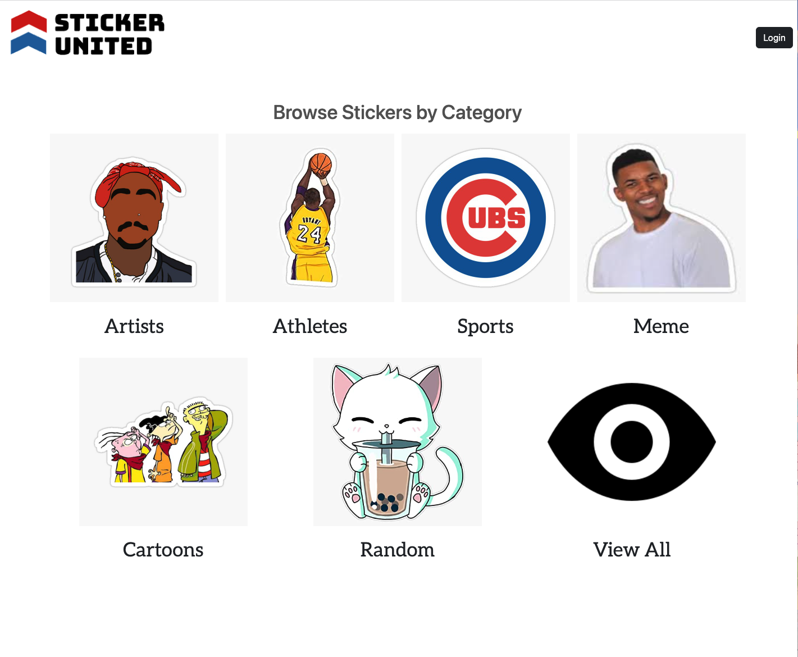
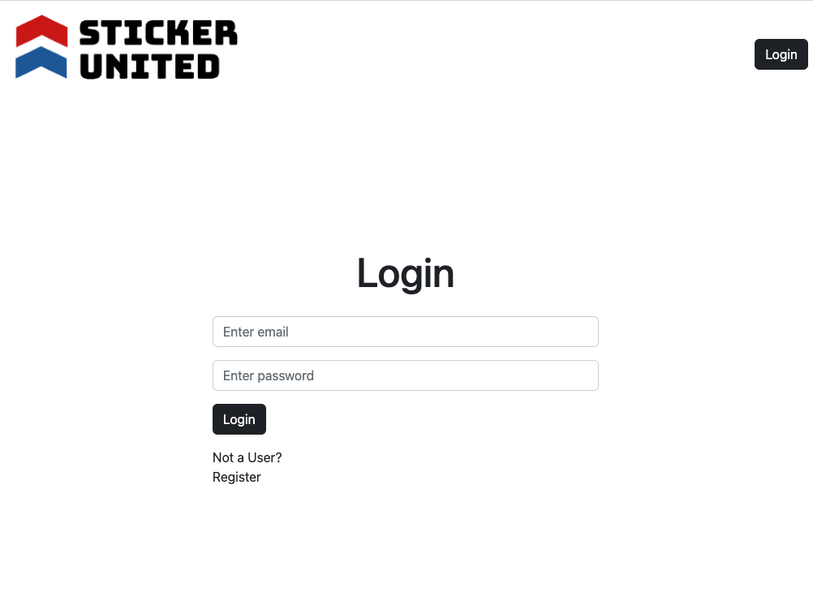
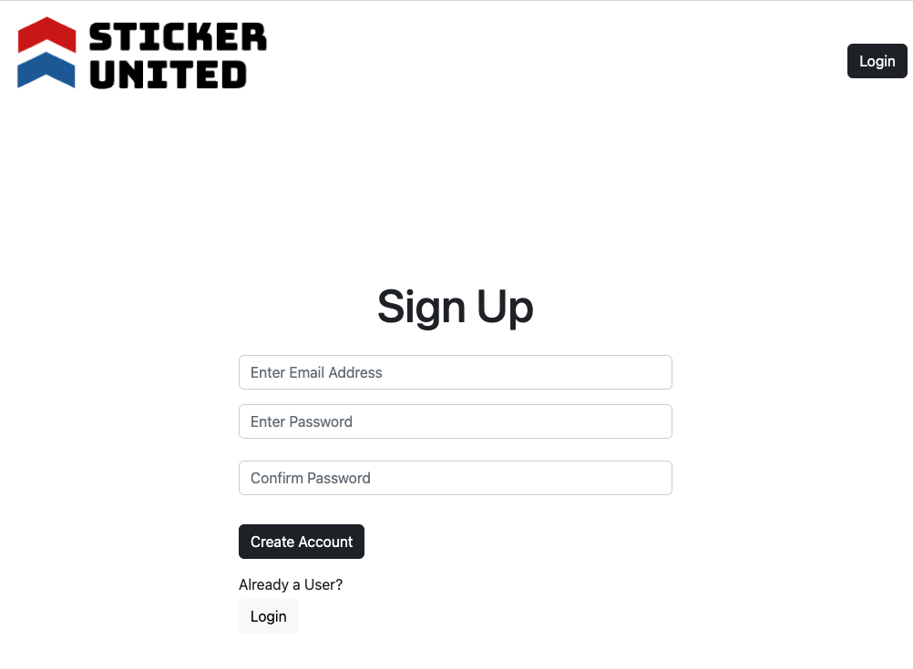

## Sticker United

## Summary
 - [About the Project](#about-the-project)
 - [Videos & Screenshots](#videos-and-screenshots)
 - [Built With](#built-with)
 - [Authors](#authors)
 - [Acknowledgments](#acknowledgments)

## About the Project
Sticker United allows you to browse stickers and keep track of your favorite ones. It is the start of an eventual e-commerce sticker shop. 

## Screenshots

## Built With
  - [Javascript](https://www.javascript.com/)
  - [NodeJS](https://nodejs.org/en/)
  - [ExpressJS](https://expressjs.com/)
  - [PostgreSQL](https://www.postgresql.org/)
  - [Sequelize](https://sequelize.org/)
  - [HTML](https://www.w3schools.com/html/default.asp)
  - [CSS](https://www.w3schools.com/css/default.asp)
  - [Bootstrap](https://getbootstrap.com/)

## Authors
 - **John Benton** - [JohnBenton4](https://github.com/JohnBenton4)
 - **Joselyn Diaz** - [jdiaz483](https://github.com/jdiaz483)
 - **Omar Rosquero** - [omardun](https://github.com/omardun)

